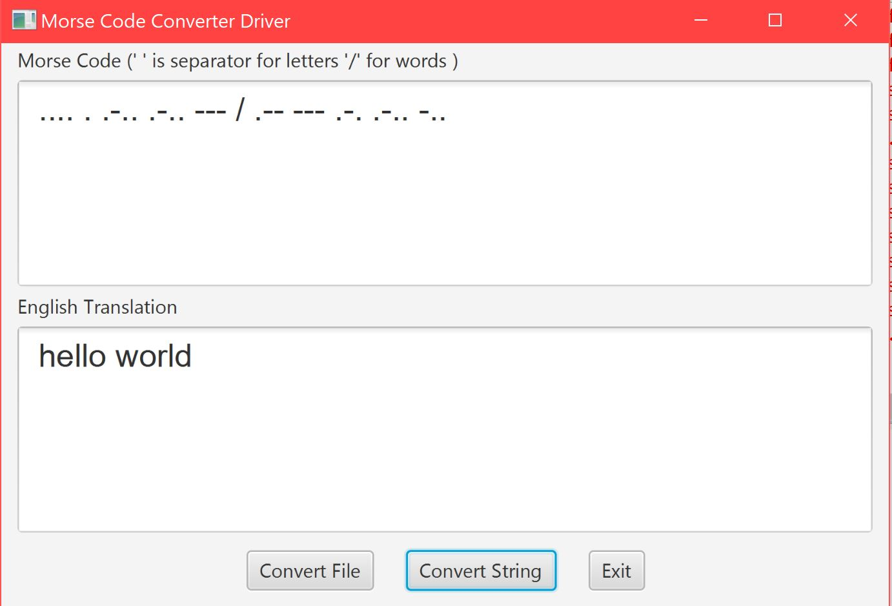

One of the most well known signals sent during distress is ". . . - - - . . ." which can be translated as SOS in Morse code.

This project hopes to mirror what communication was like in the early 1800s through a program that does conversion from Morse code to English.

What seperates this project from a conventional morse code project is the inclusion of an easy to use UI and a demonstrated ability to write elegant code with data structures and Object Oriented Programming.

The GUI was developed with JavaFX, a very powerful Desktop application.

Below is a preview of what the UI looks like

